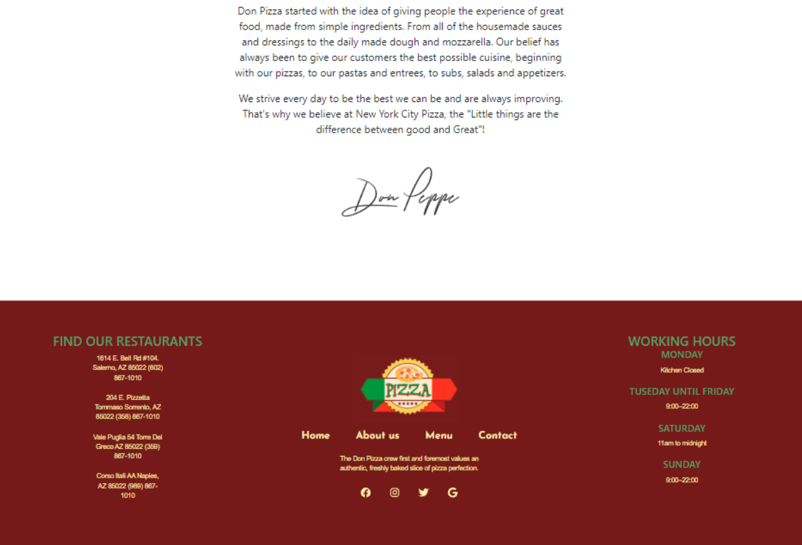
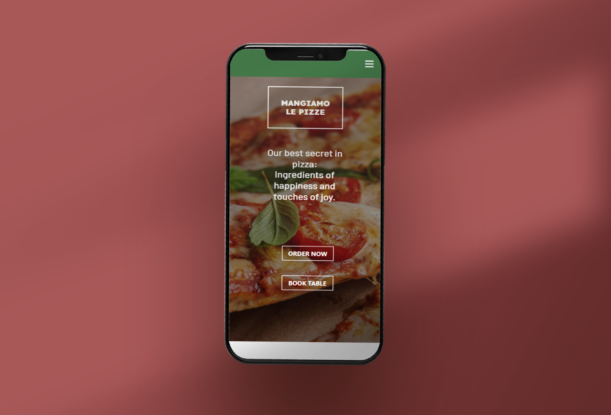

# :Pizza: Pizza place, pizza restaurant website made with React

 ## Welcome to Pizza place.
 
This is a Pizza place website made with React

## How was it built 

The project was divided into four parts, the home page, about us, menu and contact. showing photographs of the place, the products, the menu and the origins of the place are shown, as well as giving contact information and opening hours. Made fully responsive adapted to mobile devices.

-----
## Home page

-----
## Contact

-----

## Responsive

-----
## Final result

You can visit the Webpage here: [Pizza place website](https://main.d1qf6bpwrnz660.amplifyapp.com/)

-----

Made by [agostino08](https://github.com/agostino08)
